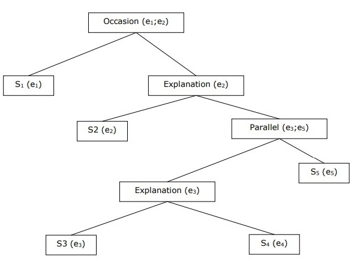

*Discourse Processing*
======================
The most difficult problem of AI is to process the natural language by computers or in other words natural language processing is the most difficult problem of artificial intelligence. If we talk about the major problems in NLP, then one of the major problems in NLP is discourse processing − building theories and models of how utterances stick together to form coherent discourse. Actually, the language always consists of collocated, structured and coherent groups of sentences rather than isolated and unrelated sentences like movies. These coherent groups of sentences are referred to as discourse.

*Concept of Coherence*
**********************
Coherence and discourse structure are interconnected in many ways. Coherence, along with property of good text, is used to evaluate the output quality of natural language generation system. The question that arises here is what does it mean for a text to be coherent? Suppose we collected one sentence from every page of the newspaper, then will it be a discourse? Of-course, not. It is because these sentences do not exhibit coherence. The coherent discourse must possess the following properties −

* **Coherence relation between utterances**

The discourse would be coherent if it has meaningful connections between its utterances. This property is called coherence relation. For example, some sort of explanation must be there to justify the connection between utterances.

* **Relationship between entities**

Another property that makes a discourse coherent is that there must be a certain kind of relationship with the entities. Such kind of coherence is called entity-based coherence.

*Discourse structure*
*********************
An important question regarding discourse is what kind of structure the discourse must have. The answer to this question depends upon the segmentation we applied on discourse. Discourse segmentations may be defined as determining the types of structures for large discourse. It is quite difficult to implement discourse segmentation, but it is very important for **information retrieval, text summarization and information extraction** kind of applications.

*Algorithms for Discourse Segmentation*
****************************************
In this section, we will learn about the algorithms for discourse segmentation. The algorithms are described below −

* **Unsupervised Discourse Segmentation**

The class of unsupervised discourse segmentation is often represented as linear segmentation. We can understand the task of linear segmentation with the help of an example. In the example, there is a task of segmenting the text into multi-paragraph units; the units represent the passage of the original text. These algorithms are dependent on cohesion that may be defined as the use of certain linguistic devices to tie the textual units together. On the other hand, lexicon cohesion is the cohesion that is indicated by the relationship between two or more words in two units like the use of synonyms.

* **Supervised Discourse Segmentation**

The earlier method does not have any hand-labeled segment boundaries. On the other hand, supervised discourse segmentation needs to have boundary-labeled training data. It is very easy to acquire the same. In supervised discourse segmentation, discourse marker or cue words play an important role. Discourse marker or cue word is a word or phrase that functions to signal discourse structure. These discourse markers are domain-specific.

*Text Coherence*
****************
Lexical repetition is a way to find the structure in a discourse, but it does not satisfy the requirement of being coherent discourse. To achieve the coherent discourse, we must focus on coherence relations in specific. As we know that coherence relation defines the possible connection between utterances in a discourse. Hebb has proposed such kind of relations as follows −

We are taking two terms ``S0`` and ``S1`` to represent the meaning of the two related sentences −

 **Result**

It infers that the state asserted by term ``S0`` could cause the state asserted by ``S1``. For example, two statements show the relationship result: ``Ram was caught in the fire. His skin burned``.

 **Explanation**

It infers that the state asserted by ``S1`` could cause the state asserted by ``S0``. For example, two statements show the relationship − ``Ram fought with Shyam’s friend. He was drunk``.

 **Parallel**

It infers p(a1,a2,…) from assertion of ``S0`` and p(b1,b2,…) from assertion ``S1``. Here ai and bi are similar for all i. For example, two statements are parallel − ``Ram wanted car. Shyam wanted money``.

 **Elaboration**

It infers the same proposition P from both the assertions − ``S0`` and ``S1`` For example, two statements show the relation elaboration: ``Ram was from Chandigarh. Shyam was from Kerala.``

 **Occasion**

It happens when a change of state can be inferred from the assertion of ``S0``, final state of which can be inferred from ``S1`` and vice-versa. For example, the two statements show the relation occasion: ``Ram picked up the book. He gave it to Shyam``.

*Building Hierarchical Discourse Structure*
*******************************************
The coherence of entire discourse can also be considered by hierarchical structure between coherence relations. For example, the following passage can be represented as hierarchical structure −

   * **S1** − Ram went to the bank to deposit money.

   * **S2** − He then took a train to Shyam’s cloth shop.

   * **S3** − He wanted to buy some clothes.

   * **S4** − He do not have new clothes for party.

   * **S5** − He also wanted to talk to Shyam regarding his health.

*Reference Resolution*
**********************
Interpretation of the sentences from any discourse is another important task and to achieve this we need to know who or what entity is being talked about. Here, interpretation reference is the key element. **Reference** may be defined as the linguistic expression to denote an entity or individual. For example, in the passage, ``Ram, the manager of ABC bank, saw his friend Shyam at a shop. He went to meet him``, the linguistic expressions like Ram, His, He are reference.

On the same note, reference resolution may be defined as the task of determining what entities are referred to by which linguistic expression.

*Terminology Used in Reference Resolution*
********************************************
We use the following terminologies in reference resolution −

1. **Referring expression** − The natural language expression that is used to perform reference is called a referring expression. For example, the passage used above is a referring expression.

2. **Referent** − It is the entity that is referred. For example, in the last given example Ram is a referent.

3. **Corefer** − When two expressions are used to refer to the same entity, they are called corefers. For example, Ram and he are corefers.

4. **Antecedent** − The term has the license to use another term. For example, Ram is the antecedent of the reference he.

5. **Anaphora & Anaphoric** − It may be defined as the reference to an entity that has been previously introduced into the sentence. And, the referring expression is called anaphoric.

6. **Discourse model** − The model that contains the representations of the entities that have been referred to in the discourse and the relationship they are engaged in.

*Types of Referring Expressions*
********************************
Let us now see the different types of referring expressions. The five types of referring expressions are described below −

* **Indefinite Noun Phrases**

Such kind of reference represents the entities that are new to the hearer into the discourse context. For example − in the sentence Ram had gone around one day to bring him some food − some is an indefinite reference.

* **Definite Noun Phrases**

Opposite to above, such kind of reference represents the entities that are not new or identifiable to the hearer into the discourse context. For example, in the sentence - I used to read The Times of India – The Times of India is a definite reference.

* **Pronouns**

It is a form of definite reference. For example, Ram laughed as loud as he could. The word he represents pronoun referring expression.

* **Demonstratives**

These demonstrate and behave differently than simple definite pronouns. For example, this and that are demonstrative pronouns.

* **Names**

It is the simplest type of referring expression. It can be the name of a person, organization and location also. For example, in the above examples, Ram is the name-refereeing expression.

*Reference Resolution Tasks*
******************************
The two reference resolution tasks are described below.

* **Coreference Resolution**

It is the task of finding referring expressions in a text that refer to the same entity. In simple words, it is the task of finding corefer expressions. A set of coreferring expressions are called coreference chain. For example - He, Chief Manager and His - these are referring expressions in the first passage given as example.

* **Constraint on Coreference Resolution**

In English, the main problem for coreference resolution is the pronoun it. The reason behind this is that the pronoun it has many uses. For example, it can refer much like he and she. The pronoun it also refers to the things that do not refer to specific things. For example, It’s raining. It is really good.

* **Pronominal Anaphora Resolution**

Unlike the coreference resolution, pronominal anaphora resolution may be defined as the task of finding the antecedent for a single pronoun. For example, the pronoun is his and the task of pronominal anaphora resolution is to find the word Ram because Ram is the antecedent.
